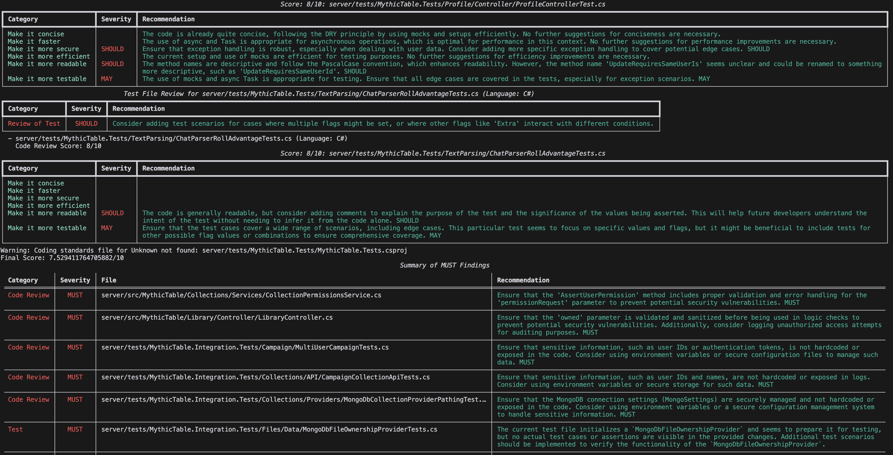

# GitLab MR Analyzer

This project analyzes GitLab Merge Requests using AI to provide code reviews and suggestions.

## Prerequisites

- Python 3.8 or higher
- pip (Python package installer)
- A GitLab account with access to the repository you want to analyze
- A GitLab Personal Access Token with API access

## Installation

1. Clone the repository:
   ```
   git clone https://github.com/yourusername/gitlab-mr-analyzer.git
   cd gitlab-mr-analyzer
   ```

2. Create a virtual environment (optional but recommended):
   ```
   python -m venv venv
   source venv/bin/activate  # On Windows, use `venv\Scripts\activate`
   ```

3. Install the required packages:
   ```
   pip install -r requirements.txt
   ```

4. Create a `.env` file in the project root directory and add your GitLab Personal Access Token:
   ```
   GITLAB_TOKEN=your_personal_access_token_here
   ```

## Usage

Run the script with the following command:
```
python gitlab_mr_analyzer.py https://gitlab.com/gitlab-org/gitlab-runner/-/merge_requests/5039
```

Example output:

